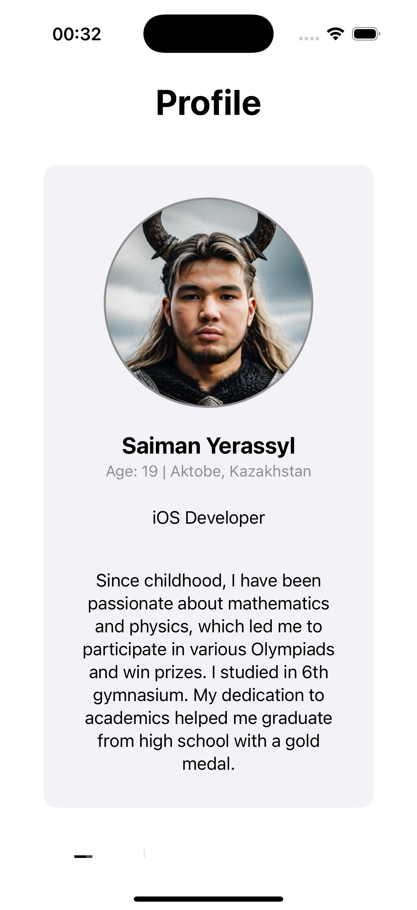
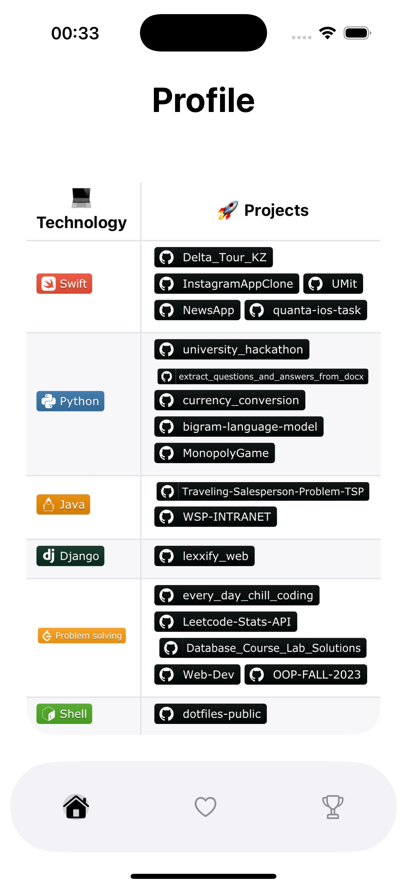
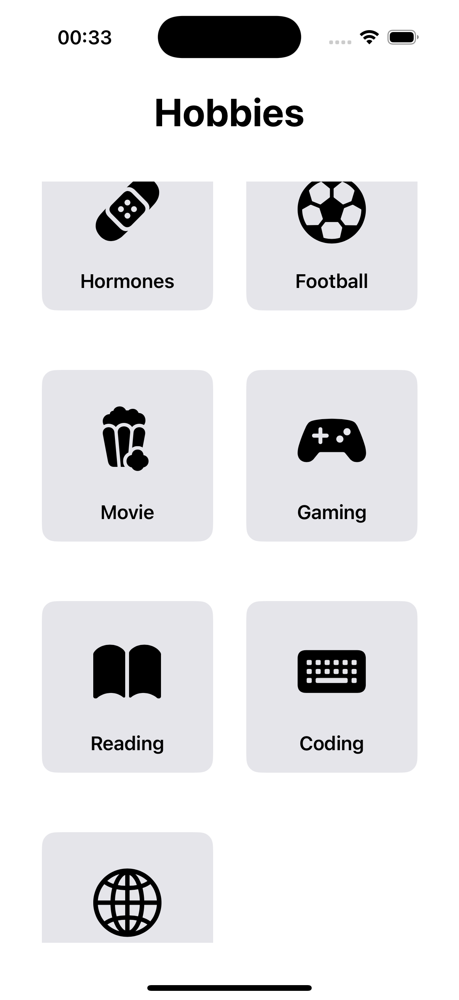
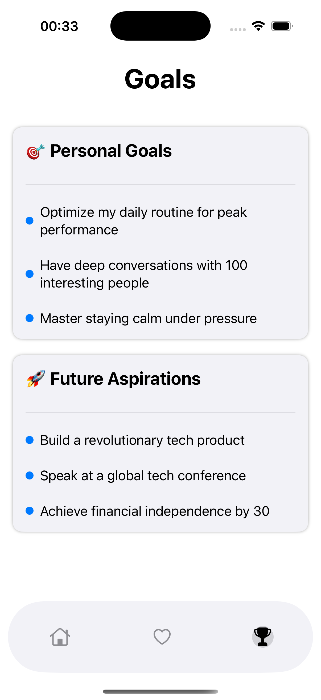

# 📌 AboutMe App  

A personal profile app built with **SwiftUI**, showcasing my goals, hobbies, and achievements in a structured and interactive way.  

---

## 🚀 Features  

 **Home Screen** – Displays profile information, including name, age, and a short biography.  
 **Hobbies Screen** – Interactive grid layout showcasing my hobbies with descriptions and videos.  
 **Goals Screen** – Organized list of personal goals and future aspirations.  
 **Custom Tab Bar** – Smooth navigation with a visually appealing tab bar.  
 **Dark Mode Support** – Dynamically adapts UI based on system settings.  

---

## 📸 Screenshots  

### 🏠 Profile screen  

      
      

### ⚽ Hobbies && Goals Screen  

      
      

---

## 📂 Project Structure  

📦 AboutMe  
├── 📂 Views  
│   ├── 📂 Home  
│   │   ├── HomeView.swift  
│   │   ├── AboutMe.swift  
│   ├── 📂 Goals  
│   │   ├── GoalsView.swift  
│   │   ├── GoalsSection.swift  
│   ├── 📂 Hobbies  
│   │   ├── HobbiesView.swift  
│   │   ├── HobbyDetailView.swift  
│   │   ├── YouTubeShortsWebView.swift  
│   ├── 📂 TabBar  
│   │   ├── CustomTabBar.swift  
│   │   ├── TabBar.swift  
├── 📂 Models  
│   ├── Hobby.swift  
│   ├── AboutMe.swift  
│   ├── TabIcon.swift  
├── README.md  

---

## 🎨 Custom Animations  

- **HomeView:** Smooth hiding/showing of the tab bar when scrolling.  
- **HobbiesView:** Tap animations for hobby cards.  
- **GoalsView:** Fade-in effects when displaying goals.  

---

## 🛠️ Technologies Used  

- **SwiftUI** – Declarative UI framework.  
- **WebKit** – Embedded YouTube Shorts player.  

---

## 📌 Future Improvements  

🚀 **Progress Tracking** – Show goal completion percentage.  
🚀 **Customizable Themes** – Allow users to choose themes.  
🚀 **More Interactive UI** – Enhance animations and user experience.  

---

## 👨‍💻 Author  

**Yerassyl Saiman** – iOS Developer passionate about creating interactive experiences.  

---

